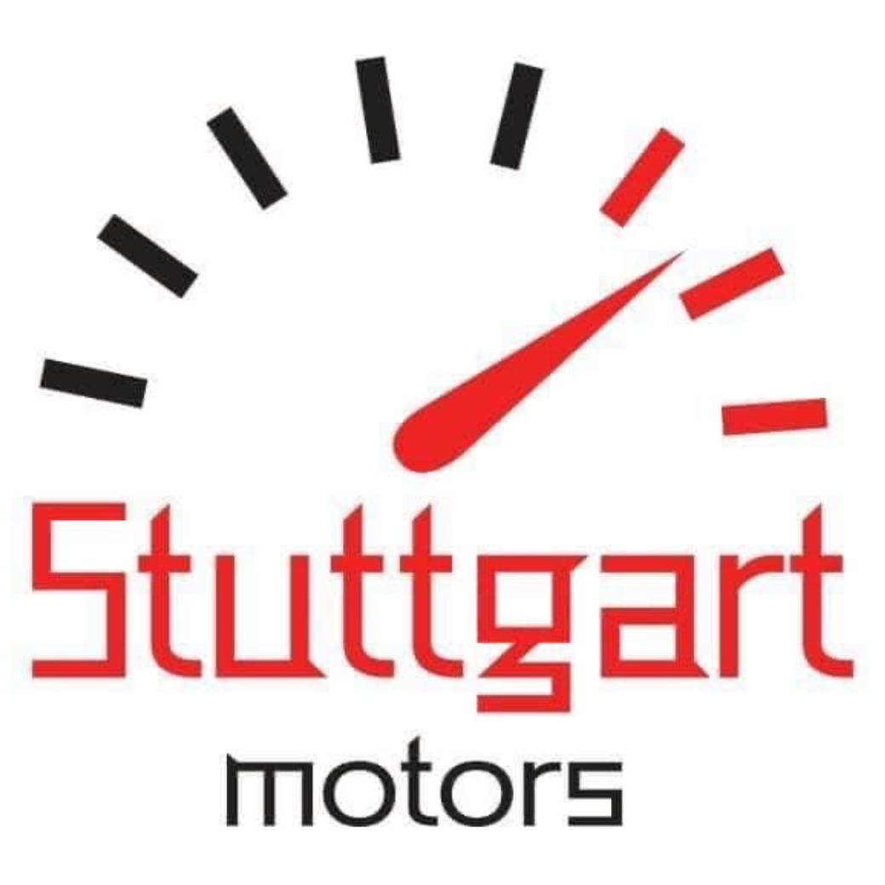
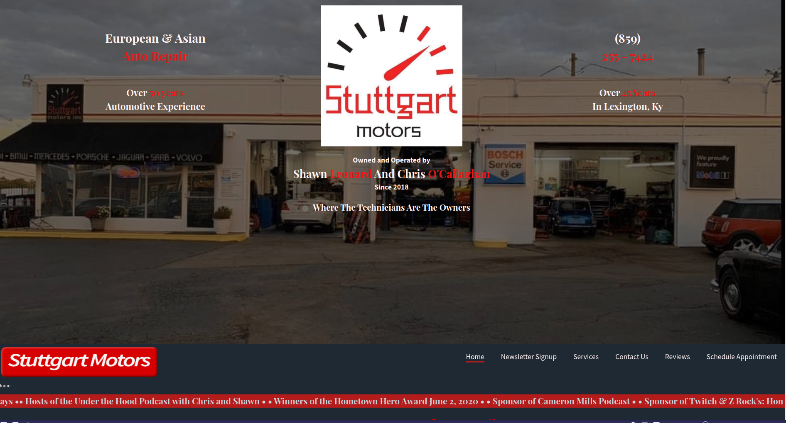
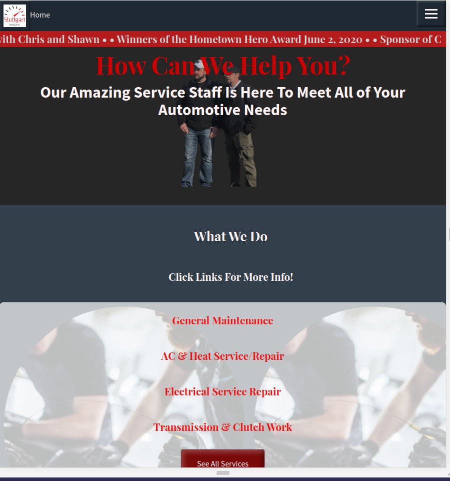
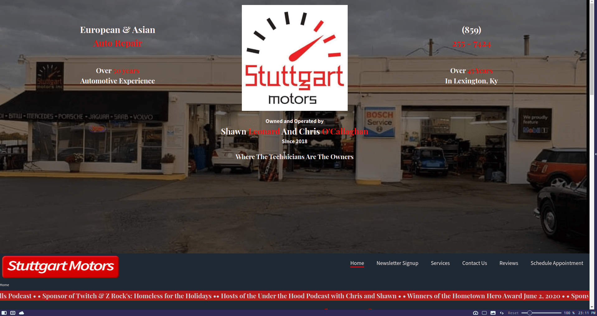

h1 align="center">
   
  
   
  Stuttgart Motors Lexington ky - Web Page
   
</h1>

## Fully Responsive

A webpage optimized for Fullscreen, tablet, and Phones. Built with Node.js, express.js, and Sass.

**Full Screen:**

**Tablet:**

**Phone:**

## Components

#### Hamburger Menu

Contains a stylized Menu icon that uses CSS animations to turn into an X when opened.
Covers 50% of the screen on tablet and 75% width on Phones.

**Phone:** 

**Tablet:**

#### Scrolling Marquee

On Full Screen and Tablet, 
has a scrolling marquee that is sticked below the Top Nav menu

## License

Stuttgart Motors Copyright © 2020 by Chaz Davis <chazdii@gmail.com>

Stuttgart Motors is free software: you can redistribute it and/or modify
it under the terms of the GNU General Public License as published by
the Free Software Foundation, either version 3 of the License, or
(at your option) any later version.

Stuttgart Motors is distributed in the hope that it will be useful,
but WITHOUT ANY WARRANTY; without even the implied warranty of
MERCHANTABILITY or FITNESS FOR A PARTICULAR PURPOSE.  See the
GNU General Public License for more details.

You should have received a copy of the GNU General Public License
along with Peek.  If not, see <http://www.gnu.org/licenses/>.

[See Complete License](./Data/gpl-3.0.txt)
